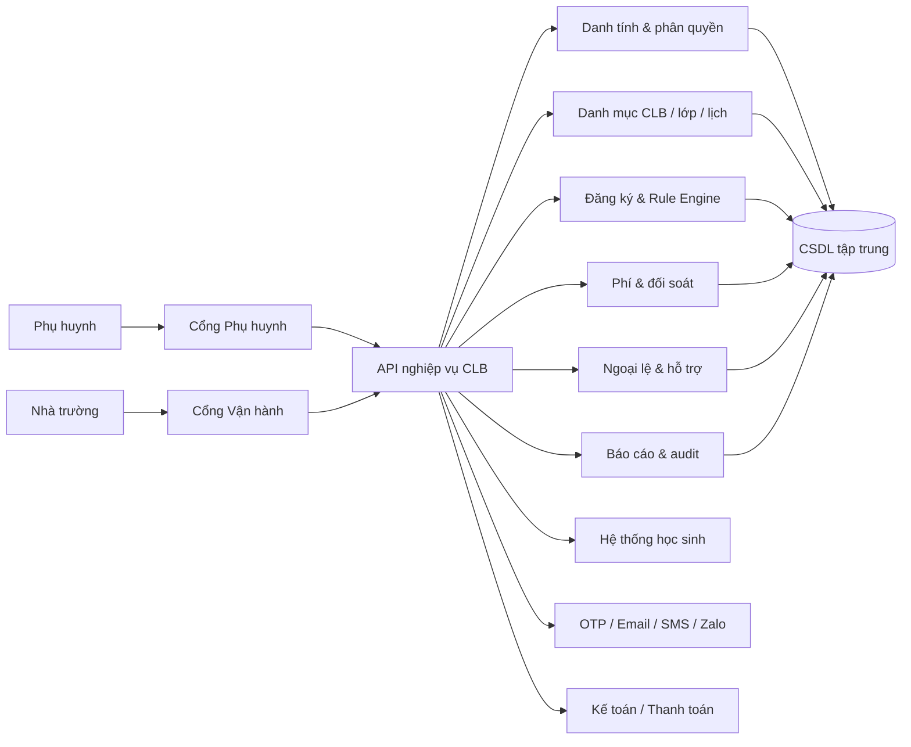
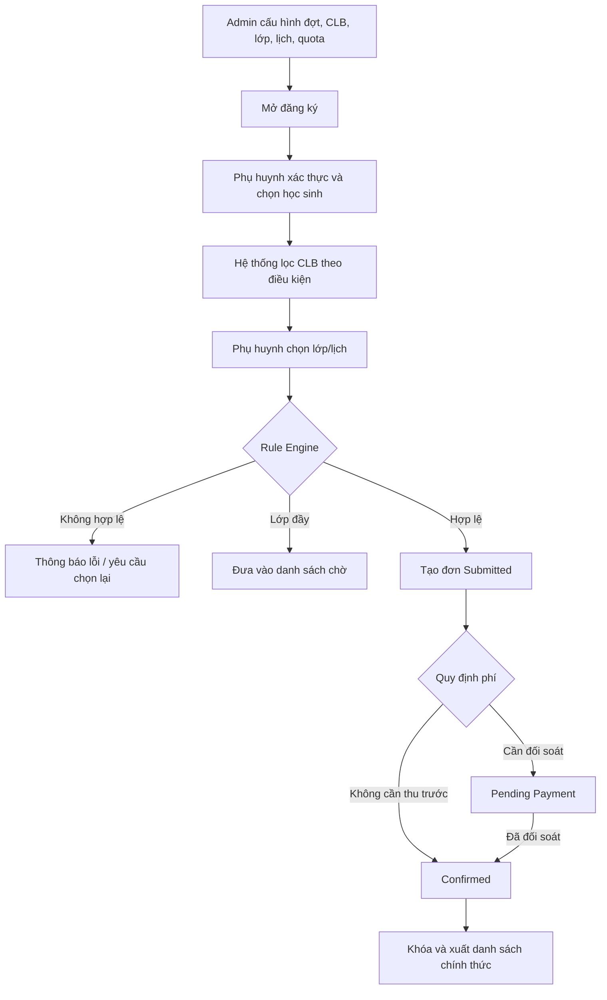
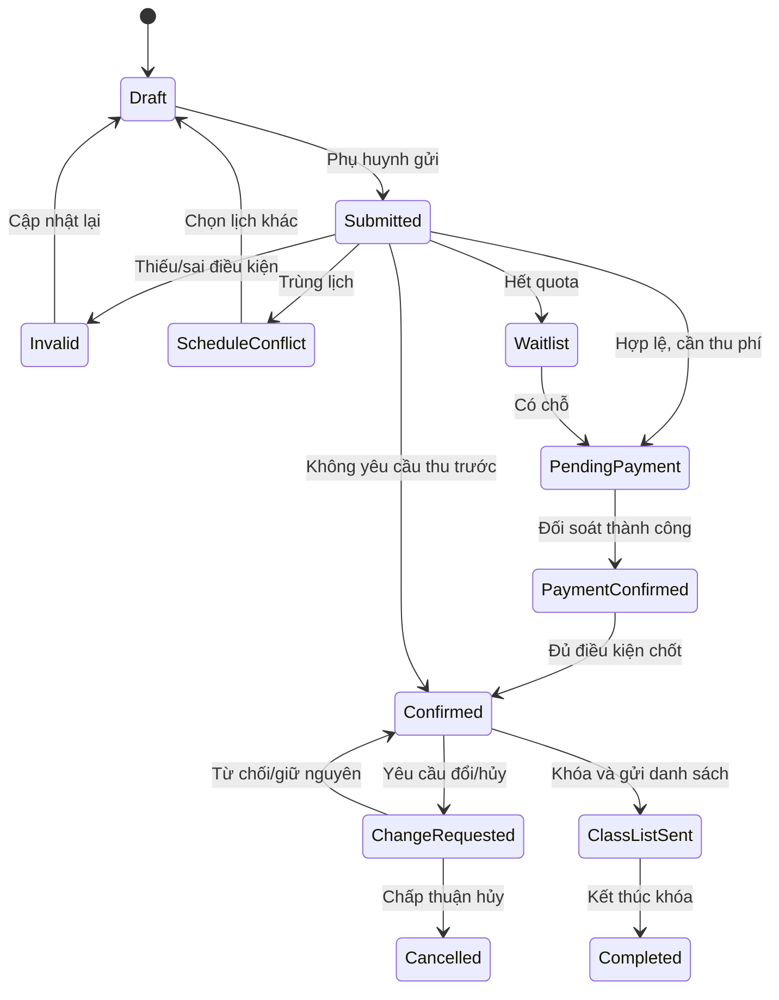
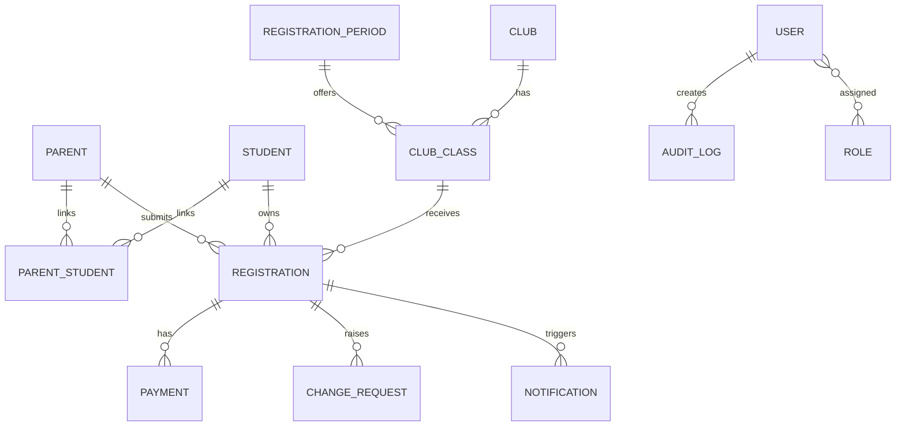

# Bản demo cấu trúc phần mềm đăng ký CLB ngoại khóa NSHM

Phiên bản: Demo BA 1.0

Ngày lập: 18/08/2026

Mục đích: Làm đầu vào thảo luận giữa NSHM, IT và vendor; chưa phải đặc tả thiết kế kỹ thuật cuối cùng.

## 1. Kết luận đề xuất

Nên triển khai MVP dưới dạng **web-app responsive, mobile-first**, dùng chung một nền tảng dữ liệu nhưng có hai cổng trải nghiệm:

- **Cổng Phụ huynh:** chọn đúng học sinh, xem CLB phù hợp, chọn lịch, nhận cảnh báo, xác nhận và theo dõi trạng thái.
- **Cổng Nhà trường:** cấu hình đợt/CLB/lớp, xử lý đơn và ngoại lệ, đối soát phí, khóa danh sách, báo cáo và phân quyền.

MVP phải giải quyết trước ba rủi ro lớn: đăng ký sai học sinh/đối tượng, vượt sĩ số và trùng lịch. Thanh toán trực tuyến, điểm danh và gợi ý lịch thông minh nên để ở giai đoạn sau nếu chưa có hệ thống tích hợp ổn định.

## 2. Phạm vi và giả định của bản demo

### Phạm vi MVP được thể hiện

- Chuyển đổi góc nhìn Phụ huynh/Nhà trường.
- Chọn học sinh và lọc CLB theo khối.
- Xem danh mục, lịch, phòng, giáo viên, học phí và quota.
- Mô phỏng kiểm tra trùng lịch và lớp đầy/danh sách chờ.
- Giỏ đăng ký, cam kết, gửi đơn và theo dõi trạng thái.
- Dashboard, quản lý đơn, xác nhận phí và xuất CSV minh họa.
- Bản đồ module và ma trận quyền tóm tắt.

### Không thuộc bản demo

- Kết nối hệ thống học sinh, OTP, email/SMS/Zalo thật.
- Cổng thanh toán, import đối soát Excel thật.
- Điểm danh, phản hồi sau buổi học, hoàn/chuyển phí.
- Backend, cơ sở dữ liệu, phân quyền và audit log thật.

### Giả định dùng để dựng demo

- Một phụ huynh có thể liên kết nhiều học sinh.
- Mỗi lớp CLB có một lịch lặp hàng tuần trong demo.
- Đăng ký lớp còn chỗ chuyển sang `Pending Payment`; lớp đầy chuyển sang `Waitlist`.
- Hai lớp có cùng chuỗi thời gian được coi là trùng lịch trong prototype. Bản thật phải so sánh khoảng thời gian và ngày hiệu lực.
- Chỉ `Confirmed` hoặc trạng thái tương đương do NSHM chốt mới được đưa vào danh sách chính thức.

## 3. Bản đồ tác nhân và quyền

| Vai trò | Mục tiêu chính | Phạm vi dữ liệu | Hành động tiêu biểu |
|---|---|---|---|
| Phụ huynh | Đăng ký đúng CLB cho con | Chỉ học sinh liên kết | Xem, tạo đơn, yêu cầu đổi/hủy, nhận thông báo |
| Vận hành CLB | Mở đợt và kiểm soát đăng ký | Các đợt/CLB được giao | Cấu hình CLB/lịch/quota, xử lý ngoại lệ, khóa danh sách |
| Giáo vụ/Điều phối | Chuẩn bị nguồn lực lớp | Lớp/lịch liên quan | Xếp phòng, lịch, giáo viên; nhận danh sách chính thức |
| Kế toán | Theo dõi và xác nhận phí | Trường dữ liệu cần đối soát | Import/xác nhận giao dịch, báo cáo phải thu/đã thu |
| Giáo viên CLB | Tổ chức lớp | Lớp được phân công | Xem danh sách chính thức, lịch và ghi chú cần thiết |
| CSKH | Hoàn tất các ca ngoại lệ | Hàng đợi cần gọi lại | Liên hệ, ghi kết quả, đề xuất lịch thay thế |
| BGH/Quản lý | Ra quyết định mở/gộp/hủy | Dashboard tổng hợp | Xem KPI, phê duyệt và theo dõi hiệu quả |
| IT Admin | Bảo đảm vận hành hệ thống | Phạm vi kỹ thuật được cấp | Tài khoản, vai trò, cấu hình, backup, log |

Nguyên tắc: quyền xem và quyền xuất dữ liệu phải tách riêng. Kế toán/giáo viên chỉ nhận đúng trường thông tin cần cho nhiệm vụ.

## 4. Kiến trúc chức năng đề xuất



### Sáu domain chức năng

1. **Danh tính & học sinh:** xác thực, liên kết phụ huynh-học sinh, RBAC và lịch sử đăng nhập.
2. **Danh mục CLB:** nhóm môn, CLB, lớp/lịch, giáo viên, phòng, học phí, điều kiện và quota.
3. **Đăng ký & kiểm tra:** giỏ đăng ký, giới hạn số CLB, điều kiện khối/lứa tuổi, trùng lịch, sĩ số và cam kết.
4. **Phí & xác nhận:** khoản phải thu, giao dịch, đối soát, xác nhận và danh sách chính thức.
5. **Ngoại lệ & hỗ trợ:** waitlist, yêu cầu đổi/hủy, lớp không đủ sĩ số, hàng đợi CSKH.
6. **Vận hành & báo cáo:** dashboard, xuất danh sách theo vai trò, khóa danh sách và audit log.

## 5. Sơ đồ điều hướng màn hình

### Cổng Phụ huynh

```text
Đăng nhập/xác thực
└── Chọn học sinh
    ├── Tổng quan đợt đăng ký
    ├── Khám phá CLB
    │   └── Chi tiết CLB → Chọn lớp/lịch → Giỏ đăng ký → Xác nhận
    ├── Đăng ký của tôi
    │   └── Chi tiết trạng thái → Yêu cầu đổi/hủy
    ├── Lịch học
    └── Yêu cầu hỗ trợ
```

### Cổng Nhà trường

```text
Dashboard
├── Đợt đăng ký
├── CLB & lịch học
├── Đơn đăng ký
│   ├── Đơn hợp lệ
│   ├── Trùng lịch / cần cập nhật
│   ├── Danh sách chờ
│   └── Yêu cầu đổi/hủy
├── Đối soát phí
├── Báo cáo & xuất file
├── Cấu trúc hệ thống
└── Cấu hình & phân quyền
```

## 6. Luồng nghiệp vụ chuẩn



## 7. Máy trạng thái đăng ký



Khuyến nghị kỹ thuật: dùng mã trạng thái cố định bằng tiếng Anh trong CSDL, còn nhãn tiếng Việt được cấu hình ở giao diện. Không cho phép sửa trực tiếp trạng thái mà phải đi qua hành động nghiệp vụ có log.

## 8. Rule Engine tối thiểu

Thứ tự kiểm tra trước khi nhận đơn chính thức:

1. Kiểm tra đợt đăng ký đang mở và học sinh còn hợp lệ.
2. Kiểm tra quan hệ phụ huynh-học sinh.
3. Kiểm tra cấp/khối/lứa tuổi và điều kiện tiên quyết.
4. Kiểm tra giới hạn số CLB theo học kỳ/nhóm môn.
5. Kiểm tra giao nhau của khoảng thời gian với đăng ký hiện có và giỏ hiện tại.
6. Giữ chỗ tạm thời hoặc kiểm tra quota bằng giao dịch nguyên tử để tránh vượt sĩ số khi nhiều người đăng ký cùng lúc.
7. Xác định luồng `Confirmed`, `Pending Payment` hoặc `Waitlist` theo cấu hình.
8. Lưu snapshot của lịch, phí và điều khoản tại thời điểm gửi để phục vụ đối soát/khiếu nại.

Điểm kỹ thuật quan trọng: chỉ đọc “số chỗ còn lại” trên giao diện là chưa đủ. Backend phải kiểm tra và cập nhật quota trong cùng một transaction/lock hoặc cơ chế đặt chỗ có thời hạn.

## 9. Mô hình dữ liệu lõi



### Thực thể và khóa chính

| Thực thể | Khóa/thuộc tính quan trọng | Ghi chú |
|---|---|---|
| `User`, `Role`, `UserRole` | user_id, status, role_code, scope | Tách tài khoản và vai trò |
| `Parent` | parent_id, phone, email, verified_at | SĐT cần chuẩn hóa trước khi tra cứu |
| `Student` | student_id, student_code, grade, homeroom, status | Đồng bộ từ nguồn chính thức |
| `ParentStudent` | parent_id, student_id, relationship, valid_from/to | Hỗ trợ nhiều người giám hộ |
| `RegistrationPeriod` | period_id, school_year, term, open_at, close_at, status | Không hard-code theo năm |
| `Club` | club_id, code, category, eligibility_rule, active | Thông tin khái quát |
| `ClubClass` | class_id, club_id, schedule, room, teacher, min/max, fee | Đơn vị nhận đăng ký/quota |
| `Registration` | registration_id, student_id, parent_id, class_id, status, submitted_at | Lưu snapshot phí/lịch/điều khoản |
| `Payment` | payment_id, registration_id, amount, method, transaction_ref, status | Có người/thời điểm xác nhận |
| `WaitlistEntry` | entry_id, registration_id, priority, status | Quy tắc ưu tiên phải cấu hình |
| `ChangeRequest` | request_id, registration_id, type, reason, status, assignee | Dùng cho đổi/hủy/cần gọi lại |
| `Notification` | notification_id, channel, template, recipient, sent_at, status | Không lưu nội dung nhạy cảm quá mức cần thiết |
| `AuditLog` | audit_id, actor, action, entity, before/after, reason, timestamp | Bắt buộc với thao tác quan trọng |

## 10. API nghiệp vụ gợi ý

| Nhóm | Endpoint minh họa | Mục đích |
|---|---|---|
| Danh tính | `POST /auth/otp/request`, `POST /auth/otp/verify` | Xác thực phụ huynh |
| Học sinh | `GET /me/students` | Chỉ trả học sinh liên kết với tài khoản |
| Danh mục | `GET /periods/{id}/clubs?studentId=...` | Trả CLB đủ điều kiện và quota hiển thị |
| Kiểm tra | `POST /registrations/validate` | Trả danh sách lỗi/cảnh báo trước khi gửi |
| Đăng ký | `POST /registrations` | Tạo đơn theo transaction/idempotency key |
| Theo dõi | `GET /me/registrations` | Lịch sử và trạng thái của phụ huynh |
| Thay đổi | `POST /registrations/{id}/change-requests` | Yêu cầu đổi/hủy có lý do |
| Vận hành | `GET /admin/registrations`, `PATCH /admin/registrations/{id}/transition` | Lọc và chuyển trạng thái theo quyền |
| Phí | `POST /admin/payments/import`, `POST /admin/payments/{id}/confirm` | Import/xác nhận đối soát |
| Báo cáo | `POST /admin/exports` | Tạo file theo mẫu và phạm vi quyền |

Yêu cầu xuyên suốt: phân quyền ở backend, idempotency cho thao tác gửi đơn/thanh toán, phân trang, lọc theo scope, log và mã lỗi dễ hiểu cho giao diện.

## 11. MVP backlog ưu tiên

### Must have

- Xác thực và liên kết đúng phụ huynh-học sinh.
- Đồng bộ/import học sinh và danh mục CLB.
- Cấu hình đợt, lớp/lịch, sĩ số, phí và điều kiện.
- Danh mục mobile-first và bộ lọc.
- Validate khối/lứa tuổi, giới hạn, trùng lịch và quota ở backend.
- Tạo đơn, waitlist, trạng thái và thông báo xác nhận tối thiểu.
- Dashboard cơ bản, xử lý đơn, khóa và xuất danh sách.
- Phân quyền, audit log, backup và bảo vệ dữ liệu cá nhân.

### Should have

- Mẫu thông báo quản trị được.
- Import đối soát từ kế toán.
- Hàng đợi cần gọi lại/đổi lịch/hủy.
- Cơ chế lớp không đủ sĩ số và phê duyệt mở/gộp/hủy.

### Could have — giai đoạn 2

- Thanh toán trực tuyến.
- Gợi ý lịch thay thế thông minh.
- Điểm danh và phản hồi sau buổi học.
- Tích hợp CRM/kế toán/SIS qua API hoàn chỉnh.

## 12. Yêu cầu phi chức năng có tiêu chí đo

| Nhóm | Tiêu chí đề xuất cho MVP |
|---|---|
| Bảo mật | RBAC tại backend; chặn truy cập chéo học sinh; MFA cho admin; mã hóa khi truyền và khi lưu phù hợp |
| Riêng tư | Chỉ thu trường cần thiết; cấu hình retention; log lượt xem/xuất dữ liệu nhạy cảm |
| Hiệu năng | P95 tải danh mục/lọc dưới 2 giây trong tải dự kiến; kiểm thử cao điểm trước ngày mở đăng ký |
| Đồng thời | Không vượt quota dù có yêu cầu đến cùng lúc; API tạo đơn idempotent |
| Sẵn sàng | Có giám sát, cảnh báo, backup và phương án xuất dữ liệu khẩn cấp |
| Khả dụng | Mobile-first từ 360 px; lỗi nêu rõ nguyên nhân và cách xử lý; WCAG cơ bản cho tương phản/focus |
| Cấu hình | Năm học, đợt, CLB, lịch, phí, quota, mẫu thông báo không hard-code |
| Audit | Lưu actor, hành động, dữ liệu trước/sau, thời điểm và lý do với thao tác quan trọng |

## 13. Kịch bản nghiệm thu trọng yếu

1. Phụ huynh A không thể truy cập học sinh của phụ huynh B, kể cả đổi ID trên URL/API.
2. Học sinh lớp 3 không thể gửi đơn cho CLB chỉ dành cho lớp 6–9.
3. Hai lựa chọn có khoảng thời gian giao nhau bị chặn và nêu rõ hai lớp xung đột.
4. Nhiều yêu cầu đồng thời ở chỗ cuối cùng chỉ tạo tối đa một suất chính thức; yêu cầu còn lại vào waitlist/thất bại theo cấu hình.
5. Gửi lặp cùng idempotency key không tạo hai đơn hoặc hai khoản phải thu.
6. Kế toán xác nhận phí làm đơn chuyển đúng trạng thái và phát sinh audit log.
7. Sau khi danh sách bị khóa, tài khoản thường không sửa được; ngoại lệ của người có quyền cao vẫn phải có lý do và log.
8. File xuất đúng bộ lọc, đúng quyền và không chứa trường dữ liệu ngoài mẫu.
9. Đóng đăng ký theo thời gian máy chủ; không phụ thuộc đồng hồ thiết bị phụ huynh.
10. Hệ thống gửi thông báo thất bại vẫn giữ đơn và cho phép gửi lại, không tạo đơn trùng.

## 14. Quyết định NSHM cần chốt trước thiết kế chi tiết

| Quyết định | Tác động nếu chưa chốt |
|---|---|
| Nguồn dữ liệu học sinh/phụ huynh và mã định danh chuẩn | Không thể thiết kế liên kết tài khoản an toàn |
| Web-app độc lập, tích hợp app hay portal hiện có | Ảnh hưởng đăng nhập, kiến trúc và chi phí |
| Thu phí trước hay sau xác nhận; chính sách miễn/giảm/hoàn/chuyển | Ảnh hưởng trạng thái, kế toán và cam kết |
| Cách ưu tiên danh sách chờ | Ảnh hưởng tính công bằng và tự động hóa |
| Giới hạn số CLB và xử lý trùng lịch ngoại lệ | Ảnh hưởng Rule Engine |
| Kênh thông báo chính và đơn vị chịu chi phí | Ảnh hưởng tích hợp và vận hành |
| Bộ mẫu báo cáo bắt buộc theo từng vai trò | Ảnh hưởng dữ liệu, quyền và kế hoạch UAT |
| Phạm vi lưu trữ, xuất và thời hạn giữ dữ liệu | Ảnh hưởng bảo mật và tuân thủ |

## 15. Kế hoạch triển khai gợi ý

1. **Discovery/chốt nghiệp vụ:** thống nhất 8 quyết định ở trên, nguồn dữ liệu và mẫu báo cáo.
2. **Thiết kế UX & kỹ thuật:** wireframe chi tiết, API contract, ERD vật lý, mô hình quyền và threat model.
3. **MVP theo lát cắt dọc:** xác thực → danh mục → đăng ký/rule → vận hành → xuất dữ liệu.
4. **UAT cao điểm:** dữ liệu mô phỏng gần thực tế, kiểm thử đồng thời/quota/bảo mật và diễn tập phương án dự phòng.
5. **Pilot:** mở cho một cấp/nhóm CLB, theo dõi log và phản hồi phụ huynh trước khi mở toàn trường.

## 16. Cách chạy và thuyết trình prototype

Mở `index.html` và đi theo kịch bản:

1. Vai trò Phụ huynh → chọn Nguyễn Minh An → Khám phá CLB.
2. Chọn Bóng rổ, sau đó thử chọn Piano để thấy chặn trùng lịch.
3. Chọn Mỹ thuật để minh họa danh sách chờ; mở giỏ và gửi.
4. Chuyển vai trò Nhà trường → Dashboard → Đơn đăng ký.
5. Lọc theo trạng thái, xác nhận phí một đơn và xuất CSV demo.
6. Mở Cấu trúc hệ thống để trao đổi 6 domain trước khi đi vào thiết kế chi tiết.
