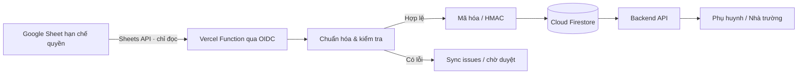

# Thiết kế đồng bộ Google Sheets an toàn

## 1. Phạm vi

Google Sheets là nguồn dữ liệu gốc cho hồ sơ học sinh và liên kết phụ huynh. Ứng dụng chỉ đọc Sheet qua một dịch vụ backend riêng rồi ghi dữ liệu đã chuẩn hóa vào Cloud Firestore. Trình duyệt và tài khoản phụ huynh không được cấp quyền truy cập Sheet.

Luồng mặc định là **một chiều**:



Không ghi ngược vào bảng nguồn trong giai đoạn đầu. Nếu cần trả trạng thái về Sheets, sử dụng một file hoặc tab báo cáo riêng với service account có quyền ghi tách biệt.

## 2. Quyền truy cập Google Sheets

- Tạo service account chuyên dụng, ví dụ `nshm-sheet-reader`.
- Chỉ chia sẻ đúng file nguồn cho email service account với quyền **Viewer**.
- Dùng Sheets API scope chỉ đọc; không dùng API key, link công khai hoặc mã OAuth trong frontend.
- Không cấp Domain-wide Delegation và không cấp vai trò quản trị Google Workspace.
- Trên Vercel, dùng OIDC và Google Workload Identity Federation để mạo danh service account bằng token ngắn hạn; không tạo khóa JSON dài hạn.
- Với máy phát triển, ưu tiên đăng nhập ADC bằng cơ chế impersonation. Nếu bắt buộc dùng tệp JSON, lưu ngoài repository, giới hạn ACL, luân phiên và thu hồi ngay sau khi chuyển sang môi trường cloud.

## 3. Chuẩn dữ liệu nguồn tối thiểu

| Trường logic | Bắt buộc | Ghi chú |
|---|---:|---|
| `student_code` | Có | Mã học sinh duy nhất, ổn định; không dùng họ tên làm khóa |
| `student_name` | Có | Họ tên đầy đủ |
| `date_of_birth` | Có | Định dạng ngày thống nhất, ưu tiên `YYYY-MM-DD` |
| `class_name` | Có | Ví dụ `3A2` |
| `education_level` | Có | Ví dụ `Tiểu học`, `THCS` |
| `father_phone` | Có điều kiện | Ít nhất một trong hai số bố/mẹ hợp lệ |
| `mother_phone` | Có điều kiện | Ít nhất một trong hai số bố/mẹ hợp lệ |
| `father_name`, `mother_name` | Khuyến nghị | Dùng để hiển thị và xử lý ngoại lệ |
| `status` | Khuyến nghị | `active`, `inactive`, `transferred` |
| `source_updated_at` | Khuyến nghị | Hỗ trợ đồng bộ tăng dần và truy vết thay đổi |

Không nên xóa hàng để thể hiện học sinh nghỉ/chuyển trường; cập nhật `status` để hệ thống có thể khóa liên kết mà vẫn giữ audit.

## 4. Quy tắc liên kết tài khoản

1. Chuẩn hóa số Việt Nam về E.164 để tra cứu nội bộ và dạng trong nước để đăng nhập: `912345678` → `+84912345678` → tài khoản `0912345678`.
2. Mỗi số điện thoại duy nhất tạo một hồ sơ người giám hộ.
3. Số bố và số mẹ tạo hai tài khoản độc lập nếu khác nhau; cả hai được liên kết với cùng học sinh.
4. Nếu một số xuất hiện ở nhiều học sinh, một tài khoản được liên kết với tất cả các học sinh đó.
5. Nếu số bố và số mẹ giống nhau, chỉ tạo một tài khoản và gắn quan hệ phù hợp.
6. Mọi thay đổi số điện thoại phải tạo lịch sử và được nhà trường duyệt; không tự động chuyển quyền truy cập giữa hai người chỉ vì một ô trong Sheet bị sửa.
7. Hàng không có mã học sinh, số điện thoại sai, mã học sinh trùng hoặc thông tin xung đột được đưa vào khu vực chờ xử lý; không ghi đè dữ liệu đang hoạt động.

## 5. Mô hình Firestore đề xuất

```text
guardians/{guardianId}
  phoneLookupHash       HMAC-SHA-256 của số đã chuẩn hóa
  encryptedProfile      tên và số điện thoại đã mã hóa
  status                active | pending | disabled
  sourceUpdatedAt

students/{studentId}
  studentCodeHash       định danh tra cứu ổn định
  encryptedProfile      họ tên, ngày sinh đã mã hóa
  className
  educationLevel
  status
  sourceRowHash

guardianStudentLinks/{guardianId_studentId}
  guardianId
  studentId
  relationship          father | mother | guardian
  status

syncJobs/{jobId}
  startedAt, finishedAt, status, counters, sourceRevision

syncIssues/{issueId}
  jobId, sourceRow, errorCode, maskedSummary, status
```

`guardianId` và `studentId` không chứa số điện thoại hay mã học sinh dạng rõ. Có thể sinh ID ngẫu nhiên hoặc HMAC theo khóa bí mật.

## 6. Mã hóa và bảo vệ dữ liệu

- Firestore đã mã hóa dữ liệu lưu trữ theo mặc định; nếu có yêu cầu tuân thủ cao hơn, tạo database mới với CMEK ngay từ đầu.
- Áp dụng mã hóa trường bằng AES-256-GCM/envelope encryption cho số điện thoại, họ tên và ngày sinh. Khóa bọc nằm trong Cloud KMS; ứng dụng chỉ có quyền mã hóa/giải mã cần thiết.
- Dùng **HMAC-SHA-256 với secret pepper** cho trường tra cứu số điện thoại. Không dùng SHA-256 thuần vì không gian số điện thoại đủ nhỏ để dò ngược.
- Lưu secret/pepper trong Secret Manager hoặc dùng KMS; không ghi vào `.env`, source code, log hoặc file Sheet.
- Log chỉ chứa mã bản ghi và số điện thoại đã che, ví dụ `******5678`; bật Cloud Audit Logs và cảnh báo truy cập bất thường.
- Firestore Rules chặn toàn bộ truy cập trực tiếp từ web; backend dùng IAM tối thiểu để đọc/ghi các collection cần thiết.
- Tách dự án `staging` và `production`, thiết lập backup/PITR, thời hạn lưu dữ liệu và quy trình xóa theo chính sách nhà trường.

## 7. Cơ chế đồng bộ

- Ban đầu: nút **Đồng bộ dữ liệu** chỉ dành cho quản trị viên, có màn hình xem trước số bản ghi thêm/sửa/khóa và danh sách lỗi.
- Khi ổn định: Cloud Scheduler gọi worker theo chu kỳ 15–60 phút.
- Mỗi hàng có checksum; bản ghi không đổi sẽ không được ghi lại.
- Ghi theo batch và idempotent; một lần chạy lỗi có thể chạy lại mà không tạo trùng tài khoản/liên kết.
- Dùng khóa chống chạy đồng thời và `sourceRevision` để tránh một bản đồng bộ cũ ghi đè bản mới.
- Không xóa cứng hồ sơ khi biến mất khỏi Sheet; chuyển sang `pending_disable` và yêu cầu duyệt.

## 8. Đăng nhập người dùng

- Phụ huynh: tài khoản là SĐT trong nước đã thêm `0`. Theo yêu cầu vận hành, mật khẩu khởi tạo bằng chính tài khoản nhưng chỉ dùng **một lần**; bắt buộc đổi sang mật khẩu riêng tối thiểu 8 ký tự, có chữ hoa, chữ thường, số và ký tự đặc biệt trước khi truy cập dữ liệu học sinh. Khóa tạm sau 5 lần sai. Giai đoạn tiếp theo nên thay mật khẩu khởi tạo bằng OTP có chống bot/rate limit.
- Nhà trường: dùng Microsoft 365 Authorization Code Flow + PKCE. Backend chỉ chấp nhận token đúng tenant Entra ID và tên miền `@hoangmaistarschool.edu.vn`; phân quyền nghiệp vụ vẫn phải ánh xạ theo nhóm/app role, không suy ra chỉ từ email.
- Backend chỉ cấp quyền xem học sinh sau khi phiên đăng nhập đã được xác minh và `guardianStudentLinks` đang hoạt động.

## 9. Thông tin cần trước khi triển khai connector

1. URL Google Sheet hoặc `spreadsheetId` và tên chính xác của tab dữ liệu.
2. Ảnh/hàng tiêu đề hoặc danh sách chính xác tên các cột; ảnh mẫu chưa có trong yêu cầu hiện tại.
3. Xác nhận cột mã học sinh duy nhất và quy tắc khi học sinh chuyển lớp/chuyển trường.
4. Xác nhận dữ liệu chỉ đọc một chiều hay cần ghi trạng thái từ hệ thống về Sheet.
5. Tần suất đồng bộ mong muốn: thủ công, theo giờ hay gần thời gian thực.
6. Tài khoản Google Cloud/Workspace nào có quyền tạo service account và chia sẻ file.
7. Nhà cung cấp OTP cho giai đoạn thay thế mật khẩu khởi tạo và nhóm/app role Entra ID dùng để phân quyền nhân sự.
8. Yêu cầu lưu trú dữ liệu, thời hạn lưu, backup và người được phép xem dữ liệu nhạy cảm.
