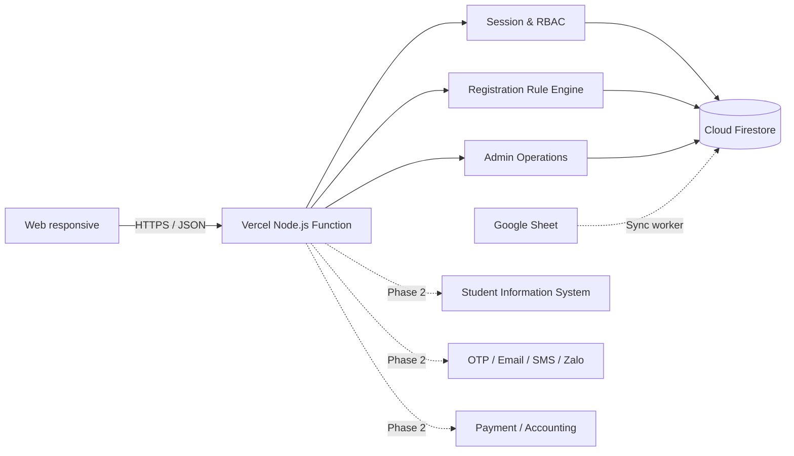

# Kiến trúc kỹ thuật NSHM Clubs MVP

## 1. Mục tiêu kiến trúc

MVP ưu tiên ba tiêu chí: có thể chạy ngay, bảo vệ dữ liệu nhạy cảm và giữ ranh giới rõ để nâng cấp. Giao diện và API chạy trong một tiến trình Node.js; dữ liệu nghiệp vụ có thể lưu trực tiếp trên Cloud Firestore hoặc SQLite khi phát triển/kiểm thử.

## 2. Thành phần

| Thành phần | Trách nhiệm |
|---|---|
| `public/` | Thư mục duy nhất được phục vụ tĩnh ra Internet |
| `public/index.html` | Khung ứng dụng, màn hình đăng nhập và thư viện icon SVG |
| `public/styles.css` | Design tokens, layout desktop/mobile, component states |
| `public/app.js` | API client, phiên UI, routing nội bộ và tương tác người dùng |
| `public/sheet-reader.js` | Đọc `.xlsx`/`.csv` ngay trong trình duyệt để file danh mục không phải rời máy người dùng |
| `catalog-schema.mjs` | Module thuần: chuẩn hóa và kiểm tra đợt/CLB/lớp, nhận diện cột và phân tích file nhập |
| `error-reporting.mjs` | Module thuần: quyết định lỗi nào được hiển thị nguyên văn, lỗi hạ tầng quy về thông báo tiếng Việt |
| `record-diff.mjs` | Module thuần: đối chiếu dữ liệu sắp ghi với bản ghi hiện có |
| `directory-plan.mjs` | Module thuần: quyết định đồng bộ danh bạ cần ghi gì, bỏ qua bản ghi không đổi |
| `server.mjs` | Static server, JSON API, session auth, validation, báo cáo CSV |
| SQLite | Dữ liệu dự phòng chỉ cho phát triển và kiểm thử local |
| `api/index.mjs` | Adapter Vercel Function và định tuyến toàn bộ API |
| `google-cloud-auth.mjs` | Đổi Vercel OIDC token thành credential Google ngắn hạn |
| `firestore-store.mjs` | Khởi tạo Google Cloud Firestore SDK, seed, transaction và adapter dữ liệu |
| Cloud Firestore | Lưu tài khoản, liên kết học sinh, session, OAuth state, đăng ký, hỗ trợ, audit, quota và catalog khi `DATA_BACKEND=firestore` |
| `sheets-directory.mjs` | Đọc metadata/range giới hạn bằng Sheets API, nhận diện cột và kiểm tra chất lượng dữ liệu |
| `tests/api.test.mjs` | Kiểm thử tích hợp trên CSDL tạm độc lập |
| `tests/catalog-api.test.mjs` | Kiểm thử tích hợp quản trị danh mục và nhập hàng loạt |
| `tests/catalog-schema.test.mjs` | Kiểm thử chuẩn hóa dữ liệu danh mục, độc lập với CSDL |
| `tests/account-support.test.mjs` | Kiểm thử tra cứu tài khoản và cấp mã kích hoạt |
| `tests/directory-merge.test.mjs` | Kiểm thử gộp ba file nguồn và quy tắc đánh dấu nghỉ học |
| `tests/directory-sources.test.mjs` | Kiểm thử cấu hình nguồn và hành vi khi một file lỗi |
| `tests/sync-scheduler.test.mjs` | Kiểm thử lịch tự đồng bộ và cách lỗi nền lộ ra |

## 3. Bảo mật đang có

- Cổng Nhà trường TỪ CHỐI theo mặc định: chỉ tài khoản đã tạo sẵn mới đăng nhập được bằng Microsoft 365. Đăng nhập không còn tạo tài khoản và không còn chạm tới vai trò — trước đây nó ép mọi người về `admin` ở mỗi lần đăng nhập, xoá sạch phân quyền đặt tay.
- Phân quyền theo NĂNG LỰC (`roles.mjs`), không theo tên vai trò. Mỗi endpoint hỏi "thao tác này cần quyền gì", nên thêm vai trò mới chỉ phải sửa một bảng thay vì rà lại hơn hai chục điểm kiểm tra rời rạc.
- `SUPERADMIN_ACCOUNTS` là đường cứu độc lập với cơ sở dữ liệu, cho trường hợp bản ghi quản trị bị vô hiệu hoá nhầm. Thiếu biến này thì cảnh báo lúc khởi động chứ không chặn khởi động — chặn là hạ luôn cổng đăng nhập của phụ huynh.
- Quyền cao nhất không cấp được từ giao diện: một tài khoản bị chiếm cũng không thể tự nâng mình lên rồi khoá người khác ra ngoài.
- Tài khoản nhà trường không xoá cứng, chỉ vô hiệu hoá; vô hiệu hoá cắt phiên đang mở ngay lập tức.

- Mật khẩu do người dùng đặt được băm bằng `scrypt` với salt riêng.
- Tài khoản phụ huynh vừa đồng bộ không lưu salt/hash: **mật khẩu khởi tạo chính là số điện thoại**, so sánh bằng `timingSafeEqual`, bắt buộc đổi ngay lần đầu. Đây là quyết định của nhà trường với đánh đổi đã biết — số điện thoại cũng là tên tài khoản nên ai biết số đều vào được cho tới khi phụ huynh đổi; lý do chọn là phát 7.119 mã giấy trước ngày mở đăng ký bất khả thi. Nhánh này chỉ áp dụng khi tài khoản chưa có hash; đặt mật khẩu riêng là nhánh đó tắt hẳn, có kiểm thử chặn hồi quy. Mã kích hoạt vẫn cấp được như phương án thay thế, và khi đã cấp thì hệ thống chấp nhận cả mã lẫn số điện thoại.
- Phiên dùng token ngẫu nhiên 256 bit; Production chỉ lưu SHA-256 của token trong Firestore.
- Cookie phiên có `HttpOnly`, `Secure`, `SameSite=Lax` và thời hạn 8 giờ ở Production.
- Kiểm tra vai trò và phạm vi học sinh được thực hiện ở API.
- Chỉ thư mục `public/` được phục vụ tĩnh (`vercel.json` đặt `outputDirectory`, server local dùng danh sách trắng). Mã nguồn backend, `firestore.rules` và tài liệu nội bộ ở thư mục gốc không truy cập được qua HTTP; có test chặn hồi quy.
- Không đưa credential vào repository.
- Firestore Rules mặc định từ chối mọi truy cập client; backend được cấp quyền qua IAM.
- Web config chỉ khởi tạo Firebase/Analytics và không mang quyền Admin.
- Có security headers cơ bản và giới hạn body JSON 1 MB (riêng hai endpoint nhập danh mục là 8 MB).
- Chỉ lỗi nghiệp vụ do hệ thống này tạo ra (`expose`) mới hiển thị nguyên văn. Lỗi từ Firestore, Google API hay mạng được quy về thông báo tiếng Việt kèm mã phân loại, không bao giờ trả nguyên văn payload của nhà cung cấp ra ngoài; mã trạng thái của lỗi hạ tầng cũng không được dùng lại làm mã HTTP trả về. Có kiểm thử chặn hồi quy trên đúng payload đã từng lọt ra màn hình đăng nhập.
- Đăng nhập đúng ngay lần đầu không phát sinh lượt ghi thừa để xóa bộ đếm sai, nhằm tiết kiệm hạn ngạch ghi của Firestore.
- Đồng bộ danh bạ chỉ ghi bản ghi thực sự thay đổi. Phần quyết định nằm ở `directory-plan.mjs` và được kiểm thử độc lập, trong đó có tính chất quan trọng nhất: đồng bộ lại một danh sách không đổi thì số lượt ghi bằng 0.
- Chuyển trạng thái phí tạo audit log trước/sau.
- Mọi thay đổi đợt, CLB và lớp đều ghi audit log kèm giá trị trước/sau; nhập hàng loạt ghi log số bản ghi tạo mới và cập nhật.
- Tra cứu tài khoản hỗ trợ chỉ trả trạng thái (đang hoạt động, chưa dùng mã kích hoạt, số lần sai, thời điểm hết khóa) và không bao giờ trả salt hay hash.
- Cấp mã kích hoạt mới đưa tài khoản phụ huynh về đúng trạng thái mà đồng bộ tạo ra: một mã dùng một lần, bắt buộc đặt mật khẩu riêng ngay lần đăng nhập kế tiếp, mã cũ hết hiệu lực. Quản trị không tự chọn mật khẩu; thao tác ghi audit log kèm lý do nhưng không ghi mã.

## 3b. Đồng bộ từ nhiều nguồn

- Danh sách học sinh nằm ở ba file Google Sheet theo cấp học. `directory-sources.mjs` đọc song song, giữ nguyên kết quả từng file kể cả khi lỗi; `directory-merge.mjs` gộp thành một ảnh chụp duy nhất trước khi đối chiếu.
- Gộp trước rồi mới đối chiếu là bắt buộc: học sinh lên cấp sẽ chuyển sang file khác, xử lý từng file rời rạc sẽ vô hiệu hóa rồi tạo lại em đó thành một người mới, mất liên kết phụ huynh và lịch sử đăng ký.
- Đánh dấu nghỉ học chỉ chạy khi **tất cả** nguồn đọc được, và dừng hẳn khi danh sách tụt quá cả ngưỡng tỉ lệ 20% lẫn 10 học sinh. Không bao giờ xóa bản ghi, chỉ đổi `status` sang `inactive`.
- Cả ba nền lưu trữ (SQLite, MySQL, Firestore) đi qua cùng một bộ lập kế hoạch `directory-plan.mjs`, nên quy tắc trên không thể lệch giữa các nền.
- `sync-scheduler.mjs` chạy đồng bộ mỗi 15 phút, một lượt tại một thời điểm, và chuyển sang trạng thái "quá hạn" khi quá lâu không có lần nào thành công — để một sự cố nền không nằm im.

## 4. Quy tắc đăng ký

API không tin kết quả kiểm tra từ trình duyệt. Khi tạo đơn, server dùng transaction của backend đang chọn (`BEGIN IMMEDIATE` với SQLite hoặc Firestore transaction) rồi kiểm tra lại:

1. Có đợt đăng ký ở trạng thái `open` và giờ máy chủ nằm trong khoảng mở–đóng của đợt. Không có thì trả `409 REGISTRATION_CLOSED`.
2. Học sinh có liên kết với phụ huynh hiện tại.
3. Tất cả lớp còn hoạt động, thuộc đợt đang mở và áp dụng cho khối của học sinh (khối lấy theo cấu hình riêng của ca, nếu ca không khai thì lấy theo CLB).
4. Không vượt quá số CLB tối đa mà đợt cấu hình, tính trên tổng số CLB học sinh đã có trong đợt cộng với lựa chọn mới.
5. Không đăng ký trùng lớp, và không đăng ký hai ca khác nhau của cùng một CLB.
6. Không giao nhau với lịch trong giỏ hoặc đăng ký hiện có.
7. Tính lại quota ngay trong transaction.
8. Lớp còn chỗ tạo trạng thái `payment`; lớp đầy tạo `waitlist`. Lớp đã tắt danh sách chờ thì báo lỗi thay vì tạo đơn chờ.
9. Lưu snapshot lịch, phí, mã đợt và thời điểm chấp nhận điều khoản.

## 5. API hiện có

| Method | Endpoint | Vai trò |
|---|---|---|
| `GET` | `/api/health` | Public |
| `POST` | `/api/auth/login` | Public |
| `POST` | `/api/auth/logout` | Đã đăng nhập |
| `GET` | `/api/me` | Đã đăng nhập |
| `GET` | `/api/students` | Phụ huynh |
| `GET` | `/api/clubs?studentId=...` | Đã đăng nhập, chỉ trả lớp thuộc đợt đang mở |
| `GET` | `/api/period` | Đã đăng nhập, trả đợt đang mở và giờ máy chủ |
| `GET` | `/api/registrations` | Theo phạm vi vai trò |
| `POST` | `/api/registrations/validate` | Phụ huynh |
| `POST` | `/api/registrations` | Phụ huynh |
| `POST` | `/api/support-requests` | Phụ huynh |
| `GET` | `/api/admin/dashboard` | Nhà trường |
| `GET` | `/api/admin/integrations/google-sheets` | Nhà trường |
| `POST` | `/api/admin/integrations/google-sheets/preview` | Nhà trường |
| `POST` | `/api/admin/integrations/google-sheets/sync` | Nhà trường, xác nhận bắt buộc |
| `GET` | `/api/auth/microsoft/status` | Công khai, không lộ secret |
| `GET` | `/api/auth/microsoft/start` | Nhà trường, bắt đầu OIDC + PKCE |
| `GET` | `/api/auth/microsoft/callback` | Microsoft Entra ID callback |
| `POST` | `/api/auth/change-initial-password` | Phụ huynh, phiên đã xác thực |
| `PATCH` | `/api/admin/registrations/:id/confirm-payment` | Nhà trường |
| `GET` | `/api/admin/reports/registrations.csv` | Nhà trường |
| `GET` | `/api/admin/periods` | Nhà trường |
| `POST` | `/api/admin/periods` | Nhà trường |
| `PATCH` | `/api/admin/periods/:id` | Nhà trường |
| `GET` | `/api/admin/catalog` | Nhà trường |
| `POST` | `/api/admin/clubs` | Nhà trường |
| `PATCH` | `/api/admin/clubs/:id` | Nhà trường |
| `POST` | `/api/admin/classes` | Nhà trường |
| `PATCH` | `/api/admin/classes/:id` | Nhà trường |
| `POST` | `/api/admin/catalog/import/preview` | Nhà trường, chỉ đọc và phân tích |
| `POST` | `/api/admin/catalog/import/commit` | Nhà trường, xác nhận bắt buộc |
| `GET` | `/api/admin/accounts/lookup?account=...` | Nhà trường, chỉ đọc trạng thái tài khoản |
| `POST` | `/api/admin/accounts/reset-initial-password` | Nhà trường, xác nhận bắt buộc |

## 6. Nâng cấp production

Trước khi dùng dữ liệu thật nên thực hiện:

1. Bổ sung OTP/MFA cho phụ huynh; Microsoft 365 SSO đã dùng Authorization Code + PKCE, tenant/domain và federated client assertion.
2. Duy trì Workload Identity Federation, không tạo khóa JSON hoặc Client Secret dài hạn.
3. Thay mã kích hoạt PH bằng OTP; áp dụng MFA Conditional Access và Entra group/app role cho nhân sự.
4. Thêm CSRF protection nếu mở rộng các kiểu xác thực/cross-origin.
5. Áp dụng rate limit, reverse proxy HTTPS, WAF và centralized logging.
6. CRUD đợt/CLB/lớp đã có; còn thiếu CRUD tài khoản, maker-checker cho hoàn/chuyển phí và quyền theo scope.
7. Bổ sung queue cho thông báo và retry đồng bộ có idempotency/checksum theo từng hàng.
8. Kiểm thử tải cao điểm, backup/restore và giám sát SLA.
9. Đồng bộ danh bạ hiện chạy trọn trong một request. Nếu danh sách vượt quá quy mô hiện tại và chạm trần thời gian của hàm, cần chuyển sang đồng bộ theo lô có con trỏ và báo tiến độ. Phản hồi của API đã trả `elapsedMs` để theo dõi mức tiệm cận trần này.
