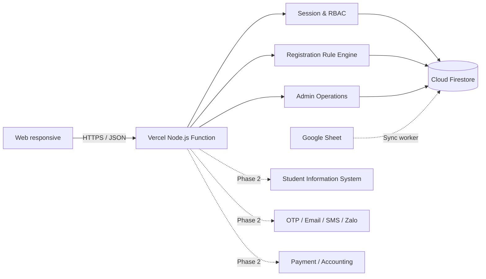

# Kiến trúc kỹ thuật NSHM Clubs MVP

## 1. Mục tiêu kiến trúc

MVP ưu tiên ba tiêu chí: có thể chạy ngay, bảo vệ dữ liệu nhạy cảm và giữ ranh giới rõ để nâng cấp. Giao diện và API chạy trong một tiến trình Node.js; dữ liệu nghiệp vụ có thể lưu trực tiếp trên Cloud Firestore hoặc SQLite khi phát triển/kiểm thử.

## 2. Thành phần

| Thành phần | Trách nhiệm |
|---|---|
| `index.html` | Khung ứng dụng, màn hình đăng nhập và thư viện icon SVG |
| `styles.css` | Design tokens, layout desktop/mobile, component states |
| `app.js` | API client, phiên UI, routing nội bộ và tương tác người dùng |
| `server.mjs` | Static server, JSON API, session auth, validation, báo cáo CSV |
| SQLite | Dữ liệu dự phòng chỉ cho phát triển và kiểm thử local |
| `api/index.mjs` | Adapter Vercel Function và định tuyến toàn bộ API |
| `google-cloud-auth.mjs` | Đổi Vercel OIDC token thành credential Google ngắn hạn |
| `firestore-store.mjs` | Khởi tạo Google Cloud Firestore SDK, seed, transaction và adapter dữ liệu |
| Cloud Firestore | Lưu tài khoản, liên kết học sinh, session, OAuth state, đăng ký, hỗ trợ, audit, quota và catalog khi `DATA_BACKEND=firestore` |
| `sheets-directory.mjs` | Đọc metadata/range giới hạn bằng Sheets API, nhận diện cột và kiểm tra chất lượng dữ liệu |
| `tests/api.test.mjs` | Kiểm thử tích hợp trên CSDL tạm độc lập |

## 3. Bảo mật đang có

- Mật khẩu demo được băm bằng `scrypt` với salt riêng.
- Phiên dùng token ngẫu nhiên 256 bit; Production chỉ lưu SHA-256 của token trong Firestore.
- Cookie phiên có `HttpOnly`, `Secure`, `SameSite=Lax` và thời hạn 8 giờ ở Production.
- Kiểm tra vai trò và phạm vi học sinh được thực hiện ở API.
- Không cho tải trực tiếp thư mục `data` qua static server; không đưa credential vào repository.
- Firestore Rules mặc định từ chối mọi truy cập client; backend được cấp quyền qua IAM.
- Web config chỉ khởi tạo Firebase/Analytics và không mang quyền Admin.
- Có security headers cơ bản và giới hạn body JSON 1 MB.
- Chuyển trạng thái phí tạo audit log trước/sau.

## 4. Quy tắc đăng ký

API không tin kết quả kiểm tra từ trình duyệt. Khi tạo đơn, server dùng transaction của backend đang chọn (`BEGIN IMMEDIATE` với SQLite hoặc Firestore transaction) rồi kiểm tra lại:

1. Học sinh có liên kết với phụ huynh hiện tại.
2. Tất cả CLB còn hoạt động và áp dụng cho khối.
3. Không vượt quá ba CLB trong một lần gửi.
4. Không đăng ký trùng lớp.
5. Không giao nhau với lịch trong giỏ hoặc đăng ký hiện có.
6. Tính lại quota ngay trong transaction.
7. Lớp còn chỗ tạo trạng thái `payment`; lớp đầy tạo `waitlist`.
8. Lưu snapshot lịch, phí và thời điểm chấp nhận điều khoản.

## 5. API hiện có

| Method | Endpoint | Vai trò |
|---|---|---|
| `GET` | `/api/health` | Public |
| `POST` | `/api/auth/login` | Public |
| `POST` | `/api/auth/logout` | Đã đăng nhập |
| `GET` | `/api/me` | Đã đăng nhập |
| `GET` | `/api/students` | Phụ huynh |
| `GET` | `/api/clubs?studentId=...` | Đã đăng nhập |
| `GET` | `/api/registrations` | Theo phạm vi vai trò |
| `POST` | `/api/registrations/validate` | Phụ huynh |
| `POST` | `/api/registrations` | Phụ huynh |
| `POST` | `/api/support-requests` | Phụ huynh |
| `GET` | `/api/admin/dashboard` | Nhà trường |
| `GET` | `/api/admin/integrations/google-sheets` | Nhà trường |
| `POST` | `/api/admin/integrations/google-sheets/preview` | Nhà trường |
| `POST` | `/api/admin/integrations/google-sheets/sync` | Nhà trường, xác nhận bắt buộc |
| `GET` | `/api/auth/microsoft/status` | Công khai, không lộ secret |
| `GET` | `/api/auth/microsoft/start` | Nhà trường, bắt đầu OIDC + PKCE |
| `GET` | `/api/auth/microsoft/callback` | Microsoft Entra ID callback |
| `POST` | `/api/auth/change-initial-password` | Phụ huynh, phiên đã xác thực |
| `PATCH` | `/api/admin/registrations/:id/confirm-payment` | Nhà trường |
| `GET` | `/api/admin/reports/registrations.csv` | Nhà trường |

## 6. Nâng cấp production

Trước khi dùng dữ liệu thật nên thực hiện:

1. Bổ sung OTP/MFA cho phụ huynh; Microsoft 365 SSO đã dùng Authorization Code + PKCE, tenant/domain và federated client assertion.
2. Duy trì Workload Identity Federation, không tạo khóa JSON hoặc Client Secret dài hạn.
3. Thay mật khẩu khởi tạo PH bằng OTP; áp dụng MFA Conditional Access và Entra group/app role cho nhân sự.
4. Thêm CSRF protection nếu mở rộng các kiểu xác thực/cross-origin.
5. Áp dụng rate limit, reverse proxy HTTPS, WAF và centralized logging.
6. Bổ sung CRUD quản trị, maker-checker cho hoàn/chuyển phí và quyền theo scope.
7. Bổ sung queue cho thông báo và retry đồng bộ có idempotency/checksum theo từng hàng.
8. Kiểm thử tải cao điểm, backup/restore và giám sát SLA.
